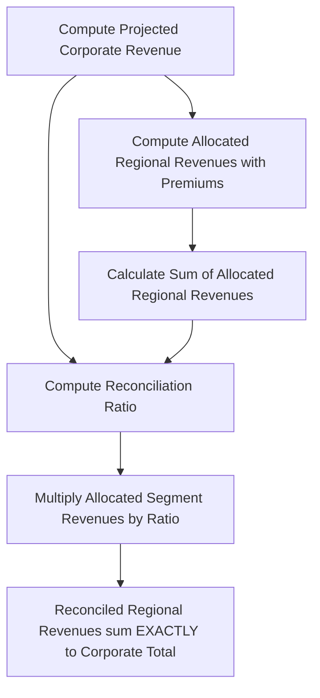

# Netflix FP&A Dashboard Methodology & Modeling Manual

This manual provides an in-depth review of the quantitative financial models, accounting reconciliation engines, driver-based forecasting algorithms, constant-currency translations, and trigger math implemented within the **Netflix FP&A Strategic Forecasting platform**.

---

## 📈 Driver-Based Multi-Scenario Forecasting Engine

Rather than using generic linear extrapolations, this platform applies an **industry-standard, seasonal YoY rolling rolling-forecast model** that preserves quarterly seasonal spikes (e.g., Q4 marketing expansions and holiday subscriber additions).

### 1. Corporate Revenue Rolling Projections
Revenues are projected on a quarterly rolling basis, matching the corresponding quarter of the previous year to eliminate seasonal bias. The forecast is driven by the baseline revenue growth rate assumptions ($g_{c,y}$) defined for each year ($y$):

$$\text{Projected Corporate Revenue}_{q, y} = \text{Corporate Revenue}_{q, y-1} \times (1 + g_{c,y})$$

Where:
*   $q \in \{\text{Q1, Q2, Q3, Q4}\}$ is the quarter.
*   $y \in \{\text{2026, 2027, 2028, 2029, 2030}\}$ is the projection year.
*   $g_{c,y}$ is the corporate revenue growth rate driver for year $y$.

### 2. Segment Revenue Allocation & Growth Premiums
To capture differing geographic expansions, segment growth is modeled by applying regional premiums ($P_r$) directly to the base corporate growth rate ($g_{c,y}$):

$$\text{Allocated Regional Revenue}_{q, y, r} = \text{Regional Revenue}_{q, y-1, r} \times (1 + g_{c,y} + P_r)$$

Where:
*   $r \in \{\text{UCAN, EMEA, LATAM, APAC}\}$ represents the geographic reporting region.
*   $P_r$ is the static regional growth premium or discount (e.g., UCAN carries a premium penalty, APAC carries an expansion premium).

---

## 🧮 Regional Reconciliation & Segment Integrity

Because regional segment revenues are calculated independently with varying growth premiums, their sum ($\sum_{r} \text{Allocated Regional Revenue}_{q,y,r}$) will naturally deviate from the overall forecasted corporate revenue. To maintain absolute structural integrity, the system applies a **Top-Down Mathematical Normalization**.

### Reconciliation Ratio Calculation:
$$\text{Reconciliation Ratio}_{q,y} = \frac{\text{Projected Corporate Revenue}_{q,y}}{\sum_{r \in R} \text{Allocated Regional Revenue}_{q,y,r}}$$

### Reconciled Segment Projection:
$$\text{Reconciled Regional Revenue}_{q,y,r} = \text{Allocated Regional Revenue}_{q,y,r} \times \text{Reconciliation Ratio}_{q,y}$$

This guarantees that:
$$\sum_{r \in R} \text{Reconciled Regional Revenue}_{q,y,r} \equiv \text{Projected Corporate Revenue}_{q,y}$$

This step ensures **zero mathematical discrepancy** ($\pm \$0.00\text{M}$) in all forecasts across all scenarios and quarters.

---

## 💱 Constant-Currency (FX-Neutral) & Translation Haircuts

Fluctuations in exchange rates (e.g., EUR, GBP, JPY relative to the USD) create translation differences in Netflix's reported top-line figures. The platform models the **FX Haircut** by analyzing the difference between Reported Growth and Constant-Currency (FX-Neutral) Growth:

$$\text{FX Haircut (basis points)} = (\text{FX-Neutral Growth Rate} - \text{Reported Growth Rate}) \times 10,000$$

### Case Study: FY2022 Historical FX Shock
In FY2022, a strong USD significantly impacted international revenues. The system models this historical transaction variance:
*   **Reported YoY Growth:** $6.45\%$ (Revenue grew from $\$29,698\text{M}$ in 2021 to $\$31,616\text{M}$ in 2022).
*   **FX-Neutral Growth:** $10.00\%$.
*   **Calculated Translation Haircut:**
    $$\text{FX Translation Haircut} = (0.1000 - 0.0645) \times 10,000 = 355\text{ bps} \ (\approx 3.55\%)$$

---

## 🚦 Strategic Trigger Logic & Algebraic Formulations

The Strategic Analysis Engine automates qualitative auditing by continuous screening against ten core equations:

### Rule 1: Positive Operating Leverage
Identifies expansion efficiencies where Operating Income grows faster than revenues, demonstrating corporate scalability:

$$\text{YoY } \Delta\% \text{ Operating Income} > \text{YoY } \Delta\% \text{ Revenue} \quad \left(\text{conditional on } \text{YoY } \Delta\% \text{ Revenue} > 0\right)$$

### Rule 2: Expense Margin Drag
Flagged when expense growth exceeds revenue growth by more than 5 percentage points, highlighting immediate margin contraction risk:

$$\text{YoY } \Delta\% \text{ Total Expense} > \text{YoY } \Delta\% \text{ Revenue} + 5.0\%$$

### Rule 3: Regional Outperformer
Flags segment revenues that outperform the total corporate growth rate:

$$\text{YoY } \Delta\% \text{ Region}_r > \text{YoY } \Delta\% \text{ Total Corporate Revenue} + 3.0\%$$

### Rule 4: Content Cost Pressure
Identifies when content amortization and delivery expenses occupy an expanding share of revenues:

$$\frac{\text{Cost of Revenues}_t}{\text{Revenue}_t} > \frac{\text{Cost of Revenues}_{t-1}}{\text{Revenue}_{t-1}} + 1.0\% \quad (100 \text{ bps increase})$$

### Rule 5: G&A Restructuring & Restructuring Spikes
Flags operational overhead spikes indicative of one-time litigation or restructuring events:

$$\text{YoY } \Delta\% \text{ G&A Expenses} > 25.0\%$$

### Rule 6: FX Translation Impact
Identifies foreign currency exchange translation shocks:

$$\left| \text{Reported Revenue Growth Rate} - \text{FX-Neutral Growth Rate} \right| > 2.0\%$$

### Rule 7: Forecast Terminal Upside Potential
Triggered when the terminal year (2030) Bull Case revenue exceeds the Base Case projection by $> 5\%$:

$$\frac{\text{Bull Revenue}_{2030} - \text{Base Revenue}_{2030}}{\text{Base Revenue}_{2030}} > 5.0\%$$

### Rule 8: Forecast Terminal Downside Margin Risk
Alerts when the terminal year (2030) Bear Case operating margin falls $> 200\text{ bps}$ below the Base Case projection:

$$\text{Base Operating Margin}_{2030} - \text{Bear Operating Margin}_{2030} > 2.0\%$$

### Rule 9: Free Cash Flow Conversion Expansion
Flags structural capital efficiency gains where FCF conversion expands significantly YoY:

$$\frac{\text{FCF}_t}{\text{Revenue}_t} > \frac{\text{FCF}_{t-1}}{\text{Revenue}_{t-1}} + 3.0\% \quad (300 \text{ bps increase})$$

### Rule 10: Regional Growth Dependency
Warns when the bulk of 5-year growth relies on international segments, indicating domestic market saturation:

$$\frac{\Delta \text{EMEA Revenue}_{2025\to2030} + \Delta \text{APAC Revenue}_{2025\to2030}}{\Delta \text{Total Corporate Revenue}_{2025\to2030}} > 50.0\%$$
