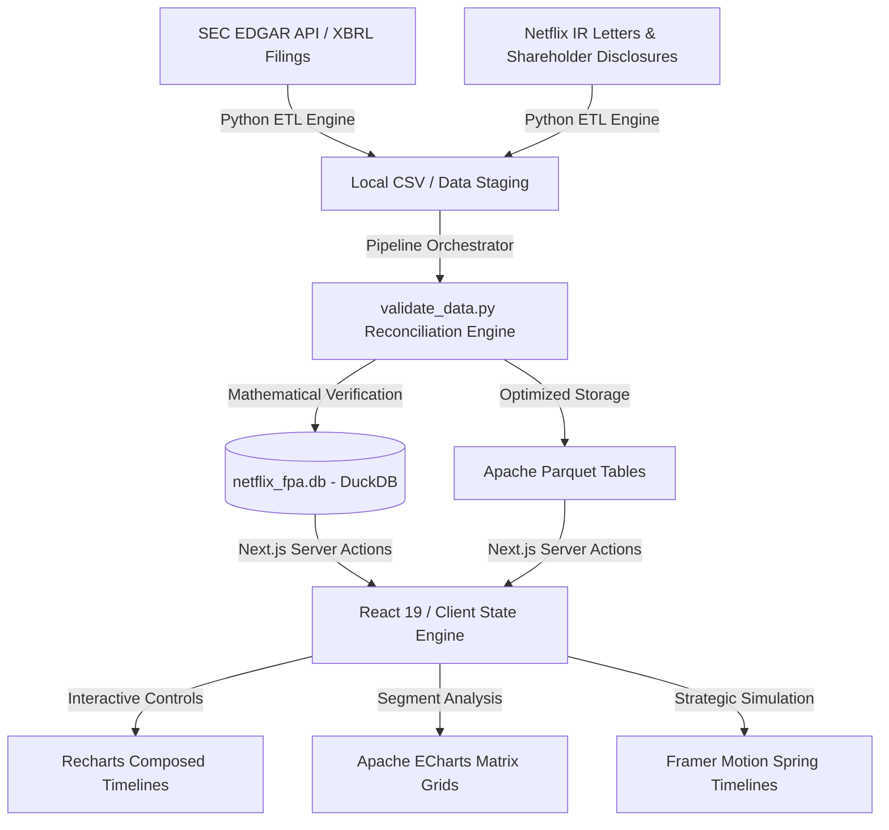

# Netflix FP&A Intelligence & Strategic Forecasting Dashboard

An executive-level, institutional-grade Corporate Financial Planning & Analysis (FP&A) platform designed to synthesize historical SEC Edgar XBRL data with dynamic, driver-based 5-year forecast models (2026–2030) for Netflix Inc. (NASDAQ: NFLX).

> [!NOTE]
> This platform represents a state-of-the-art implementation of unified corporate finance modeling and modern software engineering. It showcases absolute mathematical reconciliation across complex corporate financial statements and international business segments, fully automated qualitative variance narrations, and premium cinematic data visualizations.

---

## 🖥️ Executive Platform Architecture & Tech Stack

This platform is engineered using a highly performance-optimized, modern technology stack tailored for corporate executive reviews:



### Technical Stack Components
*   **Next.js 16 (App Router) & React 19:** Orchestrates unified multi-page layouts, responsive viewport controls, server-client hydration handshakes, and strict transactional state hooks.
*   **TypeScript 5.x:** Implements strict compile-time types for multi-dimensional financial structures (e.g., `IncomeStatement`, `CashFlowStatement`, `BalanceSheet`, and scenario-specific parameters).
*   **Tailwind CSS:** Delivers a custom-designed, dark cinematic UI styled to reflect Netflix's corporate identity. Employs premium backdrop-filters, custom-drawn scrollbars, and variable opacity borders.
*   **Apache ECharts & Recharts:** Power deep visualization sheets:
    *   **ECharts:** Generates multi-axis Waterfall Bridge charts for operating margin step-downs and quarterly regional YoY growth matrix heatmaps.
    *   **Recharts:** Renders composed lines and areas visualizing historical actuals alongside dashed multi-scenario projections with custom glassmorphic tooltips.
*   **Framer Motion:** Drives fluid interactive sliders, step-change transitions, and synchronized visual indicators.
*   **DuckDB & Apache Parquet:** Provides a sub-millisecond local analytical database. Ensures high-throughput, structured SQL queries directly on top-tier columnar files.

---

## ⚙️ Automated ETL & Mathematical Reconciliation Pipeline

The system is backed by a fully automated Python-based ETL (Extract, Transform, Load) and validation engine located in `file:///Users/negat1vekronos/Documents/New%20project/netflix-fpna-dashboard/etl/`:

1.  **SEC XBRL Data Extraction (`fetch_sec_companyfacts.py`, `fetch_sec_submissions.py`):** Programmatically queries the SEC SEC EDGAR REST API to pull Netflix's historical disclosures (`companyfacts.json`), extracting quarterly XBRL tags for Revenue, Operating Income, and Net Income.
2.  **IR Highlights Compilation (`fetch_netflix_ir_letters.py`):** Automatically extracts and processes qualitative shareholder letter disclosures, constant-currency impact metrics, and key ARPU variables.
3.  **Financial Alignment & Segment Parsing (`parse_financials.py`, `parse_regional_revenue.py`):** Synthesizes disjointed SEC filings, aligns chronological quarterly metrics, and breaks down total corporate revenues into four geographic segments: UCAN (US & Canada), EMEA (Europe, Middle East, & Africa), LATAM (Latin America), and APAC (Asia-Pacific).
4.  **Mathematical Quality Validation Engine (`validate_data.py`):** Evaluates dataset dimensions, audits for null occurrences, and enforces strict mathematical reconciliation:
    *   **Historical actuals:** Ensures the sum of the four regional segments matches corporate revenues exactly ($\pm \$0.00\text{M}$ tolerance). Any structural rounding discrepancies are programmatically balanced via the domestic UCAN segment.
    *   **Forecast scenarios:** Dynamically adjusts regional projections using regional growth premiums, then normalizes the segment outputs using a reconciliation ratio so they sum exactly to the forecasted corporate revenue.
5.  **Multi-Format Publishing:** Refreshes binary Apache Parquet files, outputs static structured JSON arrays, and rebuilds the local relational DuckDB database file (`netflix_fpa.db`).

---

## 📈 Driver-Based 5-Year Forecast Engine (2026–2030)

Projections are fully dynamic and driver-based, enabling real-time strategic modeling. The platform transitions from **actuals** (up to **2026-Q1**) into **forecast periods** (**2026-Q2 to 2030-Q4**). It supports three distinct corporate growth paths managed in `file:///Users/negat1vekronos/Documents/New%20project/netflix-fpna-dashboard/data/assumptions/forecast_assumptions_2026_2030.json`:

*   **Base Case:** Reflects Netflix's current strategic momentum, utilizing moderate ad-tier expansion and gradual international monetization.
*   **Bear Case:** Simulates competitive market saturation, increased churn, content inflation, and margin compression. Includes operational stress triggers.
*   **Bull Case:** Projects aggressive top-line acceleration driven by ad-supported model adoption, successful gaming monetization, and substantial scale efficiencies.

---

## 🔍 The 10 Core Financial Trigger Rules

The strategic engine continuously monitors corporate financials against **10 strict strategic triggers** to generate actionable, executive-level insights:

1.  **Positive Operating Leverage:** Triggers when Operating Income YoY growth rate outstrips Revenue growth rate, proving fixed-cost amortization over a larger membership base.
2.  **Expense Margin Drag:** Alerts when Total Expense growth rate exceeds Revenue growth by $> 5$ percentage points (indicates significant cost inflation or operational inefficiencies).
3.  **Regional Outperformer:** Identifies any geographic segment (e.g., UCAN, EMEA, LATAM, APAC) whose YoY growth rate exceeds overall corporate growth by $> 3$ percentage points.
4.  **Content Cost Pressure:** Highlights periods where Cost of Revenues as a percentage of revenue increases by $> 1$ percentage point YoY, signaling accelerated content spend or amortized deal structures.
5.  **G&A Transaction Pressure:** Monitors for one-time corporate restructurings or transaction spikes where G&A grows by $> 25\%$ YoY.
6.  **FX Translation Haircut:** Detects macroeconomic pressure when the difference between Reported Revenue growth and Constant-Currency (FX-Neutral) growth exceeds 2 percentage points.
7.  **Forecast Upside Potential:** Triggers if terminal year (2030) Bull Case revenue exceeds the Base Case by $> 5\%$, identifying high-margin scaling pathways.
8.  **Forecast Downside Risk:** Alerts if the terminal year (2030) Bear Case operating margin drops $> 200\text{ bps}$ below the Base Case target.
9.  **Free Cash Flow Expansion:** Identifies structural capital efficiency gains when the FCF-to-Revenue conversion ratio expands by $> 300\text{ bps}$ YoY.
10. **Regional Growth Dependency:** Warns when EMEA and APAC collectively drive $> 50\%$ of forecasted 5-year top-line growth, indicating reliance on international expansion as domestic markets mature.

---

## 🛠️ Installation, Pipeline Refresh, & Running the Platform

### Prerequisites
*   Node.js (v18.x or higher)
*   Python (v3.9 or higher with `pandas`, `duckdb`, `pyarrow` packages installed)

### 1. Project Initialization & Dependency Installation
```bash
# Clone the repository and navigate to the project directory
cd netflix-fpna-dashboard

# Install python requirements
pip install -r requirements.txt

# Install frontend dependencies
npm install
```

### 2. Executing the Data Pipeline
To refresh the database, clean the historical actuals, generate forecasts, and validate the mathematical model:
```bash
.venv/bin/python3 etl/run_pipeline.py
```

### 3. Running and Auditing the Web App
```bash
# Start development server
npm run dev

# Run comprehensive compilation checks
npm run build

# Run style audits & linter
npm run lint
```
